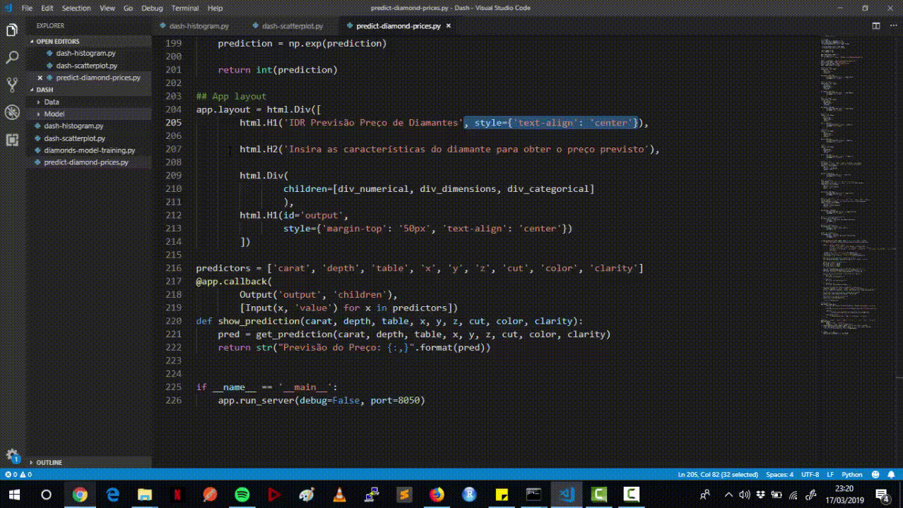

# DashDeployML
Aplicação Web construída em Dash que roda sobre um modelo de Machine Learning para previsão de Diamantes.

## Introdução

Para executar a aplicação, siga algumas instruções abaixo:

### Prerequisites

Caso você não possua a biblioteca Dash instalada no ambiente, será necessário instalá-lo. Para isso execute o comando: 

```
pip install dash.
```

## Execução da aplicação
Depois que de instalar e configurar o Dash no seu ambiente, você navega no diretório do projeto e executa os comandos abaixo:

```
python dash-histogram.py
python dash-scatterplot.py
python predict-diamond-prices.py
```

Será iniciado três servidores web interno em portas distintas e cada um deles fará uma atividade específica.

Segue uma demonstração da Aplicação:


